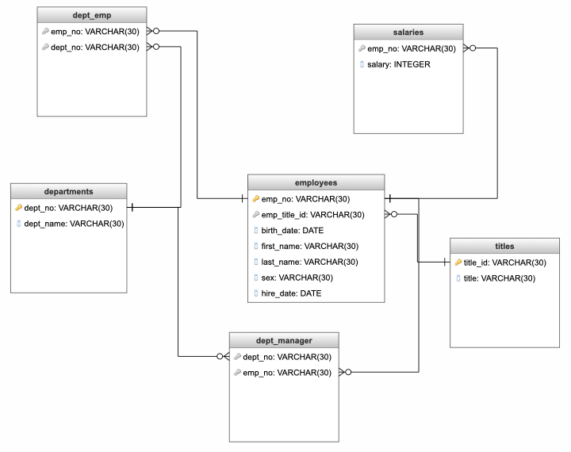

# SQL Exercise: Employee Database Data Engineering

---

---

## Contact Information

Rob Savage 

rob.savage@me.com

[LinkedIn](https://www.linkedin.com/in/robsavage/)

[Tableau Public](https://public.tableau.com/profile/rob.savage)

---

## Project Description

The purpose of this project was to use the 6 `CSVs` provided in the `data` folder to sketch out an `ERD`, then use that model as a reference when doing the data analysis on the provided employee information. 

---

## Tools Used

1. SQL (Data Engineering/Analysis)

2. [Quick Database Diagrams](http://www.quickdatabasediagrams.com) (Building ERD)

3. Github (Publishing of Results)

---

## Steps 

1. Used [Quick Database Diagrams](http://www.quickdatabasediagrams.com) to create an ERD model to better understand the data on hand. 

2. Once the model was visualized, `SQL` was used to filter the data and run the assigned analyses:

 - In order to gather the `employee number`, `last name`, `first name`, `sex`, and `salary`, an `INNER JOIN` was performed `FROM` `employees` on `salaries`
 - To query the `last name`, `first name`, and `hire date` for employees hired before 1986, I selected the appropriate columns from `employees` in `hire date` between `1986-01-01` and `1986-12-31`
 - In order to find the manager in each department `dept_manager` was selected, then an `INNER JOIN` was performed on `departments` and `employees`
 - To list the department of each employee with the following information: `employee number`, `last name`, `first name`, and `department name` an `INNER JOIN` was performed `FROM` `dept_emp` on `employees` and `departments`
 - In order to filter the `employees` names where the `first_name` is `Hercules` and the `last_name` starts with the letter `B`, `WHERE first_name = 'Hercules' AND last_name LIKE 'B%';` was run
 - To find all of the employees in the Sales department and `INNER JOIN` was performed on `employees` and `departments` `WHERE` `dept_name` = 'Sales'
 - In order to find Sales and Development employees, the same process in the previous line was run, with the exception of adding an `OR` statement including 'Development' in the query
 - Finally, in order to find the frequency count of employee last names, a `COUNT` was run on `employees.last_name` with a `GROUP BY` attached
